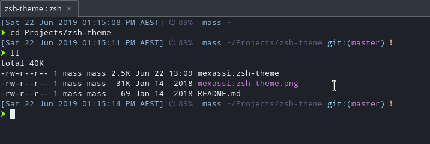

# Another oh-my-zsh theme
Checks the `/sys/class/power_supply` folders is not empty to determine if the system is installed on a laptop or desktop machine.
Reads the battery percentage grepping `acpi` command.

Developed and Tested on Manjaro

## Preview
